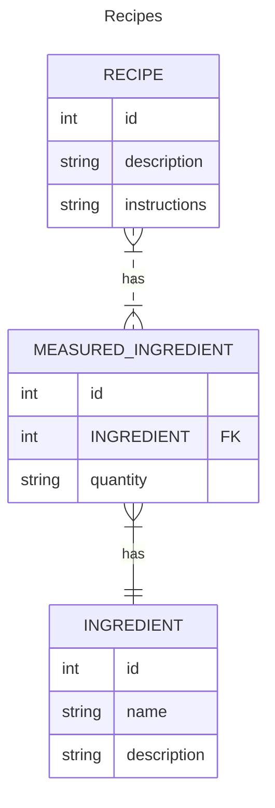

# Recipes

```mermaid
---
title: Recipes
---
erDiagram
    RECIPE }|..|{ MEASURED_INGREDIENT : has
    RECIPE {
        int id
        string description
        string instructions
    }

    INGREDIENT {
        int id
        string name
        string description
    }

    MEASURED_INGREDIENT }|--|| INGREDIENT : has
    MEASURED_INGREDIENT {
        int id
        int INGREDIENT FK
        string quantity
    }
```
